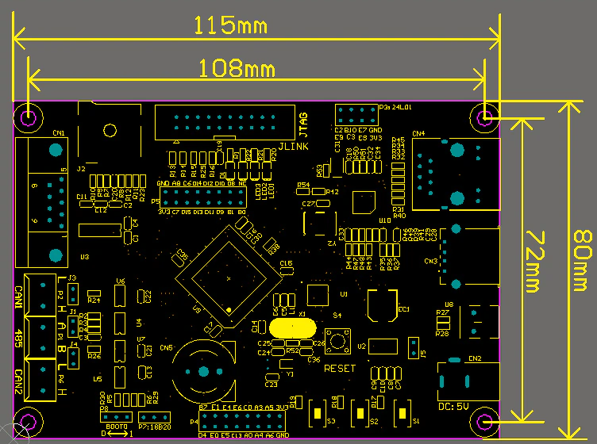

# stm32f407_dual_can_rs485

- MCU: STM32F407VET6
- 이더넷칩: DP83848
- RS232 포트: x1 UART1(PA9, PA10)
- RS485 포트: x1 UART2(PD5, PD6)
- CAN: x2 (PD0,PD1/PB5,PB6)
- TF Card: x1
- USB 인터페이스: 호스트 USB x1, 디바이스 USB x1
- 저장소: 24C02 EEPROM과 25Q64 플래시
- JTAG 인터페이스: JLINK 연결 커넥터
- 버튼: x3
- 상태 LED: x3